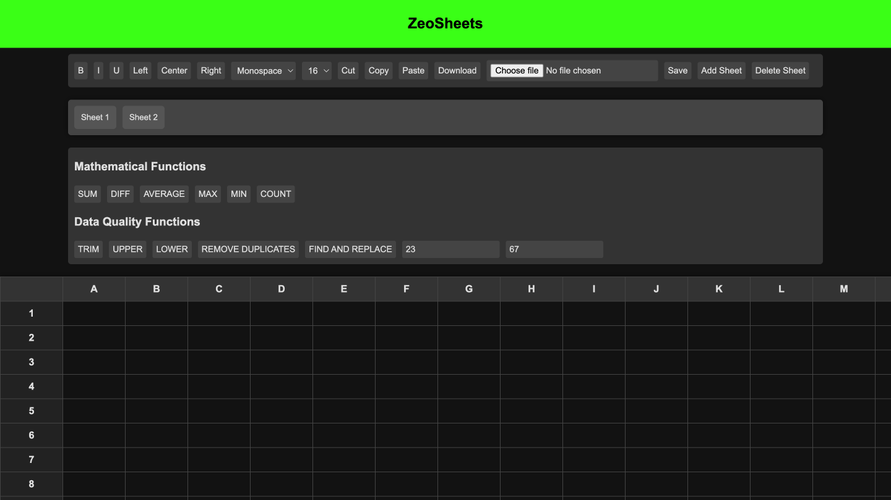
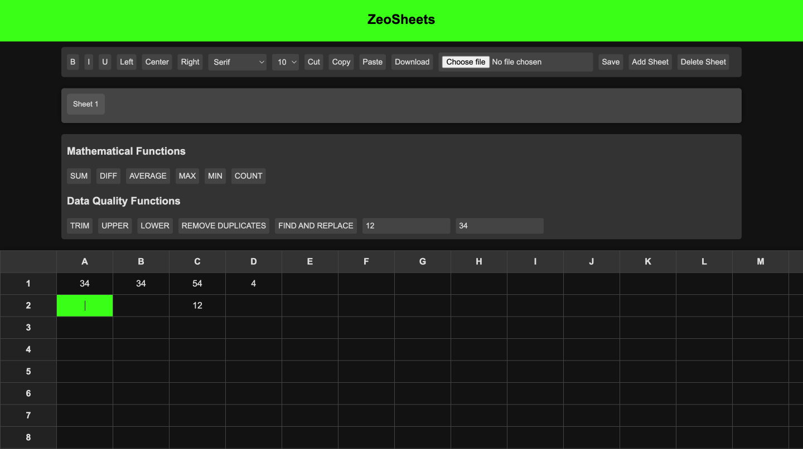
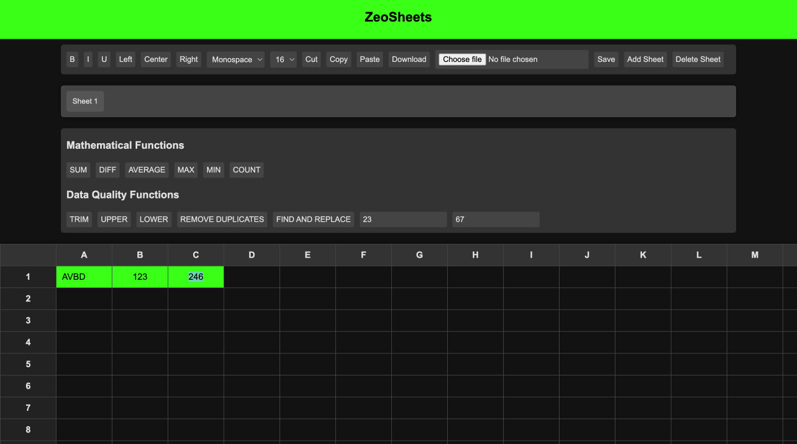

# ZeoSheets

ZeoSheets is a web application designed to mimic the user interface and functionalities of Google Sheets. It provides a familiar spreadsheet environment with essential mathematical and data quality functions, user-friendly data entry, and key UI interactions.

---


## Links

- **Project Link**: [ZeoSheets Live Link ](https://prashx1908.github.io/zeosheets/) 
- **Live Demo**: [ZeoSheets Demo](https://youtu.be/kCHCtftw-t0) 

---


## Features

### 1. Spreadsheet Interface
- **Google Sheets-like UI**: Mimics the layout and design of Google Sheets, including a toolbar, formula bar, and cell structure.
- **Drag Functions**: Drag and drop content, formulas, and selections.
- **Cell Dependencies**: Dynamically updates dependent cells when formulas or related cells are modified.
- **Cell Formatting**: Supports bold, italics, font size adjustments, and text alignment.
- **Row/Column Management**: Add, delete, and resize rows and columns.

### 2. Mathematical Functions
- **SUM**: Calculates the sum of a selected range of cells.
- **AVERAGE**: Computes the average value of a range.
- **MAX**: Identifies the maximum value in a range.
- **MIN**: Identifies the minimum value in a range.
- **COUNT**: Counts the number of numeric values in a range.

### 3. Data Quality Functions
- **TRIM**: Removes leading and trailing whitespace from cell content.
- **UPPER**: Converts text to uppercase.
- **LOWER**: Converts text to lowercase.
- **REMOVE DUPLICATES**: Removes duplicate rows from the selected range.
- **FIND AND REPLACE**: Finds and replaces specific text within cells.

### 4. Data Entry and Validation
- Supports various data types including numbers, text, and dates.
- Basic validation ensures numeric cells contain only numbers.

### Bonus Features
- Save and load spreadsheets.
- Create multiple sheets and toggle between them.
- Export data in JSON format.
- **Data Visualization** (optional): Allows the creation of charts and graphs.

---

## How to Use

1. Clone the repository:
   ```bash
   git clone <repository-link>
   ```
2. Navigate to the project directory:
   ```bash
   cd ZeoSheets
   ```
3. Open `index.html` in your browser to get started.

---

## Screenshots

### 1. ZeoSheets Interface


### 3. Mathematical Functions


### 4. Data Quality Functions



---

---

## Contributing

Contributions are welcome! Please follow these steps:
1. Fork the repository.
2. Create a new branch (`git checkout -b feature/your-feature-name`).
3. Commit your changes (`git commit -m 'Add some feature'`).
4. Push to the branch (`git push origin feature/your-feature-name`).
5. Open a pull request.

---


## Author
Developed by **Prashanth G**. For inquiries, please reach out to prashanth.dev1908@gmail.com.

